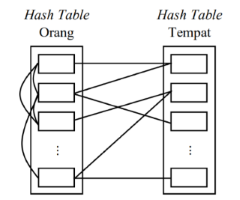

# Final Project for Data Structure Course, Informatika, ITS

> [!NOTE]
> Kode dan dokumen dalam _repo_ ini dikumpulkan pada 27 Mei 2020 sebagai tugas akhir mata kuliah Struktur Data. Oleh karena itu, _repo_ ini mungkin tidak relevan dengan kondisi penulis saat ini.

> [!NOTE]
> Dokumen ini diambil secara langsung dari dokumen [reports.pdf](reports.pdf).

## Latar Belakang

Pandemi CoViD-19 masih melanda dunia dan belum menunjukkan tanda akan usai. Sementara itu, jumlah kematian dan orang yang tertular terus bertambah. Di Indonesia jumlah orang terkonfirmasi tertular virus SARS-CoV-2 ini mencapai 22.750 orang dengan puncak pertambahan harian 973 kasus.

Pengembangan vaksin sedang dilakukan di berbagai negara. Namun, vaksin diperkirakan baru tersedia pada awal tahun 2021. Dengan begitu, untuk menangkal penyebaran virus digunakan ‘imunitas buatan’ yaitu dengan mengurangi mobilitas setiap orang. Akan tetapi, masih saja ada orang yang tidak mematuhi aturan pembatasan ini. Orang-orang masih banyak yang abai dengan masih bepergian dan mengumpulkan massa. Sehingga, penelusuran dan pelacakan virus yang berbasis hubungan perseorangan dan riwayat tempat yang dikunjungi harus dilakukan dengan cepat dan tepat.

## Analisis

Sistem pelacakan dan penelusuran ini menganalisis hubungan atau kontak seseorang dan juga riwayat tempat yang dikunjungi. Untuk itu struktur data yang tepat digunakan adalah graf.

Selain itu pencarian orang atau tempat membutuhkan waktu cepat dan tidak perlu melakukan penelusuran satu-persatu. Untuk menyiasati hal ini, daftar orang dan tempat dimasukkan dalam tabel _hash_ yang dapat diakses dengan waktu singkat menggunakan fungsi _hash_.

Struktur graf akan terdiri dari 2 _array_ yang menyimpan tabel _hash_ dari daftar oreng dan tempat. **input** yang dimasukkan pada sistem adalah 16 digit nomor KTP untuk orang dan nama tempat untuk tempat.



Dalam _hash function_, 16 digit diproses untuk diambil digit ke 7 sampai 10 yang merupakan tanggal lahir. Tanggal lahir lalu diproses untuk mendapat angka yang merupakan tanggal lahir yang dikonversi ke bentuk harian dengan asumsi 1 tahun adalah 366 hari untuk mengakomodasi tahun kabisat. Angka yang didapat kemudian dibagi 366. Sisa hasil baginya merupakan _hash value_ dari **input** tersebut.

Tanggal lahir dipilih karena lebih mudah (walau terdapat _birthday paradox_) daripada digit lainnya dari nomor KTP. Hal ini karena digit 6 digit pertama nomor KTP adalah identitas daerah. Menggunakan identitas daerah sebagai _hash value_ memungkinkan terjadinya _clustering_ karena penyebaran virus yang berbasis pada satu wilayah tertentu.

Untuk **input** nama tempat, digunakan rumus Horner pada setiap karakter pada nama tempat:

```math
H(s) = \sum_{i=0}^n s[i]\dot x^i
```

Kemudian hasil dari metode Horner tadi dibagi 265 yang merupakan ukuran tabel _hash_ dan diambil sisa hasil baginya sebagai _hash value_. _Collision resolution_ pada _hash table_ menggunakan _chaining_ sehingga bentuk _hash table_ adalah _array of list_. Sebelum dikembalikan, hasil _hash_ value ditambah 1 digit 0 atau 1 di belakangnya. Hal ini untuk membedakan hasil _hash_ value dari tempat dan orang. Penambahan digit 0 untuk menandakan tempat dan penambahan digit 1 untuk menandakan orang. Kembali pada struktur graf, untuk menyimpan _edge_ dibuat objek `Place` dan `Person`. Objek Place akan memiliki _member_ `edgePerson` yang menyimpan semua _edge_ dengan objek `Person`.


Objek `Person` akan memiliki member `edgePerson` yang menyimpan _edge_ dengan objek `Person` lainnya dan `edgePlace` yang menyimpan _edge_ dengan `Place`. Selain itu setiap objek juga memiliki member yang menyimpan identitas objek. Status untuk objek `Person` adalah “NORMAL”, “OBSERVED”, atau “CONFIRMED”. Sementara status untuk objek `Place` adalah “CLEAN” atau “INFECTED”. Selanjutnya agar bisa digunakan, diperlukan serangkaian perintah-perintah. Perintah-perintah tersebut adalah sebagai berikut:

| Perintah                  | Deskripsi                                     |
| ------------------------- | --------------------------------------------- |
| `add <id\|place>`         | Menambahkan orang atau tempat                 |
| `remove <id\|place>`      | Menghapus orang atau tempat                   |
| `info <id\|place>`        | Menampilkan informasi orang atau tempat       |
| `new <id> <id\|place>`    | Menambahkan _edge_/koneksi                    |
| `delete <id> <id\|place>` | Menghapus _edge_/koneksi                      |
| `show 'person'\|'place'`  | Menampilkan daftar orang atau tempat          |
| `normal <id>`             | Mengubah status ke normal. Untuk orang sembuh |
| `confirm <id>`            | Mengonfirmasi orang terkena virus             |
| `clean <place>`           | Menyatakan tempat telah didisinfeksi          |
| `help`                    | Menampilkan bantuan                           |
| `exit`                    | Keluar dari program                           |

Masing-masing perintah diimplementasi dengan fungsi-fungsi tertentu yang digunakan sesuai **input** pada fungsi utama. Setiap fungsi juga akan mengecek validitas dan jenis **input** untuk _error handling_.

## Desain dan Algoritma

### Fungsi `add`

Fungsi ini bertujuan menambah objek tempat atau orang pada graf. Algoritma:

1. Cek _input_ melalui hasil _hash_
2. Masukkan _input_ pada graf

### Fungsi `remove`

Fungsi ini bertujuan menghapus objek tempat atau orang dari graf. Fungsi ini juga akan otomatis menghapus semua _edge_ yang terhubung dengan objek yang akan dihapus. Algoritma:

1. Cek _input_ melalui hasil _hash_
   2a. Jika _input_ adalah tempat
   a. Hapus _input_ dari `edgePlace` semua objek `Person`
   b. Hapus objek _input_ dari graf
   2b. Jika _input_ adalah orang
   a. Hapus _input_ dari `edgePerson` objek `Person` lainnya
   b. Hapus _input_ dari `edgePlace` semua objek `Place`
   c. Hapus objek _input_ dari graf

### Fungsi `info`

Fungsi ini bertujuan menampilkan informasi objek tempat atau orang. Informasi dari objek adalah semua _member_ objek tersebut termasuk daftar _edge_. Algoritma:

1. Cek _input_ melalui hasil _hash_
2. Tampilkan semua _member_ dari objek _input_

### Fungsi `newEdge`

Fungsi ini bertujuan menambah _edge_/koneksi objek orang dengan tempat atau orang. Fungsi memiliki 2 _input_. _Input_ pertama adalah orang dan _input_ kedua adalah orang atau tempat. Algoritma:

1. Cek _input_ kedua melalui hasil _hash_
   2a. Jika _input_ kedua adalah tempat
   a. Tambahkan _input_ pertama pada `edgePerson` _input_ kedua
   b. Tambahkan _input_ kedua pada `edgePlace` _input_ pertama
   c. Jika status _input_ pertama “CONFIRMED”, status _input_ kedua menjadi “INFECTED”
   d. Jika status _input_ kedua “INFECTED” dan status _input_ pertama bukan “CONFIRMED”, status _input_ pertama menjadi “OBSERVED”
   2b. Jika _input_ kedua adalah orang
   a. Tambahkan _input_ pertama pada `edgePerson` _input_ kedua
   b. Tambahkan _input_ kedua pada `edgePerson` _input_ pertama
   c. Jika status _input_ pertama “CONFIRMED” dan status _input_ kedua bukan “CONFIRMED”, status _input_ kedua menjadi “OBSERVED”
   d. Jika status _input_ kedua “CONFIRMED” dan status _input_ pertama bukan “CONFIRMED”, status _input_ pertama menjadi “OBSERVED”

### Fungsi `deleteEdge`

Fungsi ini bertujuan menghapus _edge_/koneksi objek orang dengan objek tempat atau orang dari graf. Fungsi memiliki 2 _input_. _input_ pertama adalah orang dan _input_ kedua adalah orang atau tempat. Algoritma:

1. Cek _input_ kedua melalui hasil _hash_
   2a. Jika _input_ kedua adalah tempat
   a. Hapus _input_ pertama dari `edgePerson` _input_ kedua
   b. Hapus _input_ kedua dari `edgePlace` _input_ pertama
   2b. Jika _input_ kedua adalah orang
   a. Hapus _input_ pertama dari `edgePerson` _input_ kedua
   b. Hapus _input_ kedua dari `edgePerson` _input_ pertama

### Fungsi `show`

Fungsi ini bertujuan menampilkan daftar orang atau tempat yang ada pada graf. Fungsi ini menerima _input_ “person” atau “place”. Algoritma:

1. Cek _input_
   2a. Jika _input_ adalah “place”, tampilkan semua objek `Place` dalam graf
   2b. Jika _input_ adalah “person”, tampilkan semua objek `Person` dalam graf

### Fungsi `confirm`

Fungsi ini bertujuan mengonfirmasi orang terkena virus. Lalu, fungsi ini akan mengubah status orang dan tempat yang terhubung dengan orang yang dikonfirmasi. Algoritma:

1. Mengubah status _input_ menjadi “CONFIRMED”
2. Mengiterasi `edgePlace` pada _input_
   a. Mengubah semua status orang pada `edgePerson` dari tempat menjadi “OBSERVED”
   b. Mengubah status tempat menjadi “INFECTED”
3. Mengubah semua status orang pada `edgePerson` pada _input_ menjadi “OBSERVED”

### Fungsi `normal`

Fungsi ini bertujuan mengubah status orang menjadi “NORMAL”. Fungsi ini digunakan jika orang sudah sembuh, _edge_ dengan orang terkonfirmasi dihapus, atau terjadi kesalahan perintah. Algoritma:

1. Mengubah status _input_ menjadi “NORMAL”

### Fungsi `clean`

Fungsi ini bertujuan mengubah status orang menjadi “NORMAL”. Fungsi ini digunakan jika orang sudah sembuh, _edge_ dengan orang terkonfirmasi dihapus, atau terjadi kesalahan perintah. Algoritma:

1. Mengubah status _input_ menjadi “NORMAL”

### Fungsi Lainnya

Fungsi `showHelp` berfungsi untuk menampilkan bantuan berupa daftar perintah. Sementara fungsi `getCommand` yang berfungsi mengambil line perintah dan membaginya menjadi beberapa bagian _input_ dan perintah.

Fungsi `digit` digunakan untuk mendapatkan jumlah digit dalam integer. Sementara fungsi `isAllDigit` berfungsi untuk menentukan apakah semua karakter _input_ merupakan angka.

Fungsi `hashing` berfungsi untuk menghitung _hash_ value dan mengembalikan nilai ID yang merupakan _hash_ value yang ditambah 1 digit 0 atau 1 di belakang.

Fungsi `main` merupakan fungsi utama. Fungsi ini mengambil _input_ dari pengguna lalu menjalankan _infinite loop_ dan terus mengambil _input_ perintah hingga mendapatkan perintah `exit`.

## Penutup

Program ini merupakan masih merupakan model kecil dari sistem yang lebih besar dan belum siap pakai. Pengembangan model kecil ini juga akan dilanjutkan untuk menyempurnakan sistem. Harapannya, program kecil ini bisa menginspirasi pemrogram lain untuk membuat program besar yang siap pakai sehingga dapat benar-benar membawa pengaruh dan membantu penanganan pandemi CoViD-19 di Indonesia.
